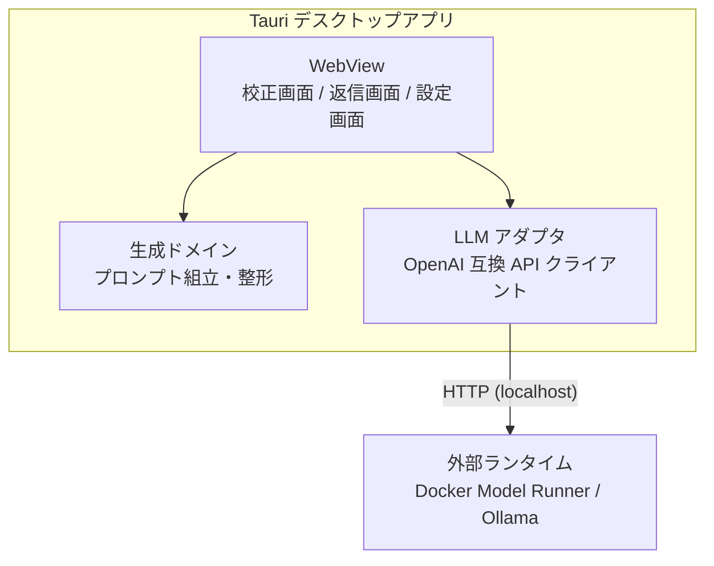
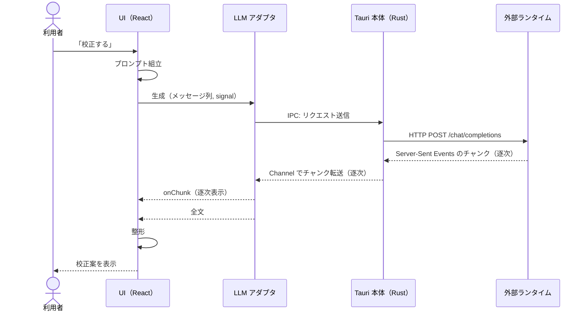

# メッセージ校正デスクトップアプリの設計

`docs/requirements.md` の要件を実現する設計を定義する。

---

## 1. 全体アーキテクチャ



- シェルは Tauri v2
  - WebView は OS ネイティブのものを使う。macOS では WKWebView[^1]
  - 使える Web 標準機能は Safari 基準で判断する
- LLM への HTTP は `tauri-plugin-http` の `fetch` を使う
  - リクエストが Rust 側から出るため、WebView の CORS 制約を受けない
  - Origin ヘッダを削って送ることで、ランタイム側の CORS 設定も不要になる[^2]
  - レスポンスボディは `ReadableStream` として受け取れる
- ロジックはすべてフロントエンド側に置く
  - 自作の Rust コードは書かず、プラグインの登録だけを行う

## 2. 技術スタック

| 領域 | 選定 | 理由 |
|---|---|---|
| シェル | Tauri v2 | 学習対象。軽量で macOS ネイティブ WebView を使う |
| HTTP | tauri-plugin-http | CORS 制約の解消。ストリーミング対応 |
| UI | React | 学習対象 |
| ルーティング | TanStack Router v1 | 学習対象。型安全なルート定義 |
| ビルド | Vite | Tauri + React の標準構成 |
| 言語 | TypeScript | ドメインロジックの型安全 |
| テスト | Vitest | ドメインロジックの単体テスト |
| ログ | tauri-plugin-log | Rust 側のログ出力。開発ビルドでのみ登録する |
| Lint / Format | oxlint / oxfmt | Vite（Rolldown）と同じ oxc 基盤で揃える。型情報を使った lint には oxlint-tsgolint を併用する[^3] |
| パッケージ管理 | pnpm | 学習対象。依存の install スクリプトを既定で実行しない等、サプライチェーン耐性が高い |
| 設定永続化 | localStorage | 設定は数キーのみで Web 標準で足りる[^4] |
| CSS | 素の CSS | プリプロセッサもフレームワークも使わない。最新の標準機能を使う（§4） |

外部ライブラリは上記のみ。以降の追加は Web 標準 API での代替を検討してからにする[^5]。

## 3. 外部送信の防止

メッセージの送信先を利用者が指定したローカルエンドポイントのみに限る（N1）。
次の三層**すべて**で成り立たせる。
一つでも欠けると本文が外部へ出る。

| 層 | 設定 | 塞ぐもの |
|---|---|---|
| capability の scope | 許可 URL を接続先ランタイムの baseUrl 配下だけに限定 | tauri-plugin-http のリクエスト先 |
| `maxRedirections: 0` | リダイレクトを追跡しない | scope 通過後の遷移先[^6] |
| CSP | `connect-src` に localhost を含めない | WebView 自身の通信、フォーム送信、base URL の書き換え[^7] |

## 4. Web 標準 API の採用

機能要件に加え、学習目的で次の標準 API を使う。

- **Streams API**：LLM 応答の逐次処理
  - `res.body → TextDecoderStream → 自作 TransformStream（Server-Sent Events の分割）→ JSON 解釈`
  - ストリーミング表示は学習目的（R6）で採用する
- **AbortController**：生成の中断。やり直しや画面遷移時に使う
- **Clipboard API**：生成結果のコピー
- **Popover API + CSS Anchor Positioning**：コピー結果の通知
  - コピーボタンを `anchor-name` でアンカーにし、`position-anchor` で直上に配置する
  - JavaScript での座標計算をなくす
- **CSS**：ネイティブ Nesting、`:has()`、`@layer`、`oklch()`
  - 配色はライト固定とし、OS がダークでも `color-scheme: light` を宣言する

## 5. 画面構成

- `__root`：共通レイアウト。ヘッダーと接続状態表示
  - `/`：校正画面
  - `/reply`：返信画面
  - `/settings`：設定画面

### 5.1 校正画面 `/`

上から順に次の要素を縦に並べる。

1. シーン切替：ビジネス / カジュアルのセグメント型トグル
2. 入力エリア：メッセージを貼るテキストエリア
3. 「校正する」ボタン：生成中は「中断」に変わる
4. 校正案エリア：校正案を逐次表示する
5. 「コピー」ボタン：結果を Popover で短く通知する

- ボタンは「校正する」と「コピー」の2つのみ
  - 校正し直したいときは「校正する」を再度押す
- モデルが未選択なら、この画面の代わりに設定画面への案内を出す

### 5.2 返信画面 `/reply`

上から順に次の要素を縦に並べる。

1. シーン切替：校正画面と同じ部品
2. 「相手のメッセージ」入力エリア
3. 「伝えたいこと」入力エリア：返信に書く要点と、判断の背景を書く
4. 「返信を作る」ボタン：生成中は「中断」に変わる
5. 返信案エリア：逐次表示する
6. 「コピー」ボタン

- 両方の入力が空でない間だけ「返信を作る」を押せる（F14）
- モデルが未選択なら、校正画面と同じく設定画面への案内を出す
- 「相手のメッセージ」を「伝えたいこと」の上に置く
  - 受け取ったメッセージを読んでから要点を書く順になり、操作の流れに合う

### 5.3 設定画面 `/settings`

- **接続先**：Docker Model Runner / Ollama のプリセットから選択
- **モデル**：接続先の `/models` から取得した一覧から選択
  - 接続先を切り替えると取得し直す
- 選択と同時に localStorage へ書き込む

### 5.4 シーン定義

| シーン | 文体 | 想定の送り先 |
|---|---|---|
| ビジネス | 整ったですます調。過剰な敬語にはしない | 社外や目上 |
| カジュアル | くだけたですます調。絵文字や「！」は原文のまま保つ | 社内の同僚 |

どちらのシーンでも読みやすさと簡潔さを優先する。

## 6. 状態の設計

アプリ全体で共有する状態は、2つの Provider がルートで持つ。

| Provider | 持つもの | 更新する契機 |
|---|---|---|
| 設定 | 接続先ランタイムと使用モデル | 設定画面での選択 |
| ランタイム状態 | 到達可否とモデル一覧 | 起動時、接続先の切り替え、生成の通信結果 |

- 設定は保存のたびに localStorage と state の両方を更新し、読む側は state だけを見る
  - 保存が全画面へ即座に伝わり、値の持ち主が1つに定まる
- 到達可否とモデル一覧は `/models` への1回の通信で両方が決まるため、1つの Provider にまとめる
  - 到達できたうえでの失敗は、接続できている証拠として扱う[^8]
- ルーターのローダーは使わない[^9]
- 非同期処理を `useEffect` で起動するのは、起動時の到達確認だけ
  - 接続先の切り替えはイベントハンドラから直接呼ぶ
- 画面固有の状態は、画面ごとの hook が1つにまとめて持つ
  - コンポーネントは受け取った値を描くことに専念する

## 7. ディレクトリ構成と依存ルール

Feature 型 + ポート＆アダプタで構成する。

```
src/
├─ main.tsx               合成の起点。Provider を組み立て、アプリ全体で使う adapter を注入する
├─ routes/                ルート定義。画面ごとの adapter を注入する薄い層
├─ features/              カプセル化。公開は index.ts のみ。feature 同士は参照しない
│  ├─ proofread/
│  │  ├─ components/      画面
│  │  ├─ domain/          校正のプロンプト組立
│  │  ├─ hooks/           画面の状態と操作
│  │  └─ index.ts
│  ├─ reply/
│  │  ├─ components/      画面
│  │  ├─ domain/          返信のプロンプト組立
│  │  ├─ hooks/           画面の状態と操作
│  │  └─ index.ts
│  └─ settings/
│     ├─ components/
│     ├─ domain/          設定の保存先のポート
│     ├─ hooks/           設定の状態と操作。設定の Provider もここに置く
│     └─ index.ts
├─ adapter/               外部世界との接続実装
│  ├─ llm/                OpenAI 互換 API。tauri-plugin-http を使う唯一の場所
│  └─ storage/            設定永続化（localStorage）
├─ api/                   LLM API との契約。接続先・メッセージ形式・エラー種別・設定の型
├─ components/            アプリ共通 UI。状態を持たず、受け取った値を描く
├─ domain/                アプリ共通の純粋ロジック。利用シーンと生成結果の整形
├─ hooks/                 アプリ共通 hooks。Context と Provider、生成とコピーの共通 hook を置く
└─ styles/                @layer の順序定義とデザイントークンのみ
src-tauri/                Tauri シェル（規約による固定名）
```

依存はすべて一方向にする。

```
routes → features → api・components・hooks・domain
adapter → api
```

- `api/` は LLM API との契約を定義するだけで、通信そのものは持たない
  - 契約を使って実際に通信するのが `adapter/llm/`
  - `domain/` と `features/*/domain/` は校正と返信そのもののドメインで、`api/` とは別物
- 共通の UI 部品は状態を持たない
  - 状態と操作はページの hook が1つにまとめ、部品には props で渡す
  - 複数の画面で使うロジックは `hooks/` の共通 hook に置き、ページの hook が組み立てる
- feature が定義したポート（例: `StreamTextFn`）に、合成の起点が adapter の実装を注入する
  - adapter は features を知らず、features は adapter の実装を知らない
  - ドメインロジックは fetch や Tauri に依存しない純粋 TypeScript になり、単体でテストできる

### 7.1 コンポーネントの分割

次のいずれかを満たすものだけ切り出す。素の HTML と切り出したコンポーネントを同じ階層に並べない。

1. 自分の状態を持つ
2. アクセシビリティの作り込みがある
3. 表示の関心が親と独立している

- スタイルを持つコンポーネントには同名の `.css` を隣接させ、ルートクラス名でスコープする
  - CSS を複数のコンポーネントで共用しない
- `styles/` には `@layer` の順序（reset → tokens → components）とデザイントークンだけを置く

### 7.2 命名

- 型、クラス、定数の `LLM` は全大文字にする（`LLMError`、`LLM_RUNTIMES`）
  - 変数、プロパティ、関数は先頭のみ小文字にする（`llmStartHint`）
  - 語中に `Llm` を置かない
- 状態を表す語は `status` に統一する
- 関数は動詞で始める（`buildPrompt`、`getLLMRuntimeById`）

## 8. 校正の設計

`features/proofread/` の構成。

| モジュール | 責務 |
|---|---|
| `domain/prompts.ts` | シーン別システムプロンプト、few-shot 例、実行時指示の組立 |
| `hooks/useProofreadPage.ts` | 入力欄の状態とプロンプト組立。生成そのものは共通 hook に委ねる |

生成の実行、逐次表示、整形、中断、エラー種別は校正と返信で共通で、`hooks/` と `domain/` に置く。

### 8.1 プロンプト設計の原則

事前検証の実測に基づく[^10]。

- システムプロンプトは最小ルールのみ。禁止ルールは書かない
- 入力は固定の依頼文で包み、校正対象のデータであることを形式で示す
- 実行時指示は操作の手順ではなく「出力が満たすべき条件」の形で書く
- few-shot 例の役割はフレームの形と校正の方向性の提示に限る
  - 例は実際のメッセージの分布に近づける[^11]
- シーンはシステムプロンプトと few-shot 例の差し替えで実現する

### 8.2 生成パラメータと出力の扱い

- temperature は 0.7 とする
  - 事前検証の実測をもとに決めた値で、案の多様性（F3）を担保する[^12]
  - E4B で決めた値であり、既定モデルを 12B に上げた後は測り直していない
- 推論モデルの思考出力は止める
  - 思考は表示せずに捨てるため、出したぶんがそのまま待ち時間になる[^14]
- 出力の妥当性はアプリが機械的に判定しない
  - 校正案が原文の意味を保っているかの確認は利用者が行う

### 8.3 校正のシーケンス



Tauri 側の処理は次のとおり。

- Tauri 側の処理はすべて tauri-plugin-http の中で完結する
- WebView の `fetch` 互換 API は IPC で Rust 側に委譲され、実際の HTTP 通信は Rust の HTTP クライアントが行う
  - WebView から直接通信しないため、CORS 制約を受けない
- レスポンスボディは Tauri の Channel で WebView へ逐次転送され、JS 側では標準の `ReadableStream` として見える
  - 以降の変換は §4 のとおり WebView 内で行う
- 中断は `AbortSignal` が IPC 経由で Rust 側に伝わり、進行中のリクエストが中止される

## 9. 返信の設計

`features/reply/` の構成。
校正と同じ形にし、違うのはプロンプトと入力欄の数だけにする。

| モジュール | 責務 |
|---|---|
| `domain/prompts.ts` | シーン別システムプロンプト、few-shot 例、2つのフレームの組立 |
| `hooks/useReplyPage.ts` | 2つの入力欄の状態とプロンプト組立。生成そのものは共通 hook に委ねる |

### 9.1 プロンプト設計

§8.1 の原則をそのまま当てはめる。
返信固有の点だけを挙げる。

- 相手のメッセージと要点を、それぞれ別のフレームで包む（F15）
  - どちらが素材でどちらが指示かを、形式で示す
- 出力条件は、相手のメッセージの論点ごとに返すことを求める[^15]
- 伝えたいことには、返信に書く内容と判断の背景が混ざる
  - 背景は文面の選び方にだけ反映し、本文には出さない
  - 条件に書くだけでなく、背景を含む few-shot 例で示す
- 返信の長さは相手のメッセージに合わせる
  - few-shot 例に長短の幅を持たせて示す[^15]

## 10. エラー処理

adapter は失敗に種別を付けて投げ、画面はその種別で表示を分ける。

| 種別 | 意味 |
|---|---|
| `unreachable` | 接続先に到達できない |
| `model-not-found` | 到達はできたが、指定したモデルが存在しない |
| `other` | 到達はできたが、生成そのものが失敗した |

| 状況 | 挙動 |
|---|---|
| 接続先に到達できない（生成時） | 生成結果エリアに状態とランタイムの起動方法を表示し、設定画面へ誘導 |
| 接続先に到達できない（設定画面） | モデル欄にランタイムの起動方法を案内 |
| モデルが存在しない | 状態を表示し、設定画面へ誘導 |
| 生成の中断 | エラー扱いにせず、接続状態も変えない[^13] |
| モデル未選択 | 画面の代わりに設定画面への案内を出す |

校正と返信で挙動は同じで、表示先だけが各画面の生成結果エリアになる。

- HTTP 200 で流れてくるストリーム内のエラーと、断片が一度も届かない終了も失敗として扱う
  - どちらも拾わないと、画面が空欄のまま終わって原因が残らない
- 生のエラー文字列は `<details>` に残す

## 11. テスト

- 単体テスト（Vitest）は、ドメイン、adapter、UI に付随する純粋ロジックが対象
  - 校正の `prompts.ts`：system + few-shot 対 + 実入力の並びと、フレームの形を検証
  - 返信の `prompts.ts`：同上に加え、2つのフレームの並び順を検証
  - `cleanGeneratedText.ts`：思考タグ、区切り線、引用符の除去を検証
  - Server-Sent Events 分割の TransformStream：チャンク境界がイベント途中で切れるケースを含めて検証
  - `client.ts`：送信内容、エラー種別、リダイレクト禁止を、fetch をモックして検証
  - 設定の保存先：保存した値の読み戻しと、壊れた値を既定値に戻すことを検証
  - 接続状態の判定：到達できたうえでの失敗を接続できている証拠として扱うことを検証
  - ボタンの活性化判定：ポインタとキーボードを取り違えず、二重に発火しないことを検証
- UI と中断経路の自動テストは持たない
  - DOM テスト基盤の追加は外部ライブラリを増やすため、必要が生じてから判断する
- 実モデルでの品質確認は手動で行う

---

[^1]: Tauri は Chromium を同梱せず OS の WebView を使う。macOS は WKWebView（WebKit）、Windows は WebView2（Chromium）、Linux は WebKitGTK。

[^2]: tauri-plugin-http は Rust 側で Origin を必ず付ける。ローカルの LLM ランタイムはこれを CORS 検査にかけるため、許可リストを緩めない限り応答が返らない。Origin に空文字を渡すとプラグインがヘッダごと削除する。プラグインの `unsafe-headers` feature が前提。

[^3]: oxfmt は beta（pre-1.0）だが、Prettier の JS/TS 準拠テストに 100% 合格しており、大規模 OSS での採用実績もある。安定版が出たら追従する。

[^4]: WKWebView のウェブサイトデータは OS の管理で削除され得る。保存先は bundle identifier で区切られるため、識別子を既定値から変えないと他アプリと領域を共有する。

[^5]: 外部ライブラリは流行り廃りとメンテナンスコストのリスクがあるため、明示的に選定したものだけ使う。Web 標準 API はそのリスクが低い。

[^6]: capability の scope 検査は最初の URL にしか適用されず、リダイレクト先は再照合されない。追跡を許すと、localhost を先に掴んだプロセスが返す 308 応答で本文が外部へ出る。この通信は Rust 側から出るため CSP は関与しない。

[^7]: capability の scope が制限するのは tauri-plugin-http 経由の通信のみで、WebView 標準の `fetch` や画像読み込みは対象外。CSP はこちらを塞ぎ、依存パッケージに紛れたコードからの外部送信も防ぐ。

[^8]: モデル未検出や生成エラーは、ランタイムに届いたからこそ返ってくる。これを未接続と表示すると、利用者は起動済みのランタイムを疑うことになる。

[^9]: ローダーは React の外で走るため、Provider の設定を読めない。ローダーから localStorage を直接読むと、設定の持ち主が state とストレージの2系統に割れる。

[^10]: 検証時の実測で、禁止ルールの追加はその語をかえって誘発して悪化した。操作の手順説明（「そこで文を区切って書き直して」）はベースラインより悪化し、出力条件の記述（「一つの文に『が、』を2つ以上含めない」）だけが有意に改善した。few-shot は語彙を写すが操作は般化しなかった。

[^11]: 複数文、約100文字、質問を含む、という分布を指す。

[^12]: 事前検証で temperature を 0.4 まで下げたところ、再校正しても同じ案に収束する事象が出た。低温度は F3 と両立しない。

[^13]: 中断された通信を「接続できない」と扱わないよう、adapter は中断時の例外に種別を付けずそのまま伝える。

[^14]: 実測。返信1件で 1973 トークンのうち約 1800 が思考だった。生成時間の 95% を占め、止めると 2 分台が 10〜20 秒台になった。思考は `delta.reasoning_content` として届き、`delta.content` しか読まないこの設計では表示されずに捨てられる。

[^15]: 調整時の実測。「相手の質問には漏れなく答える」とだけ書いた段階では、報告や依頼が返答から漏れて淡白な返信になった。長さも同様で、「相手に合わせる」と条件に書いても効かず、few-shot に長短の幅を持たせて初めて追従した。
