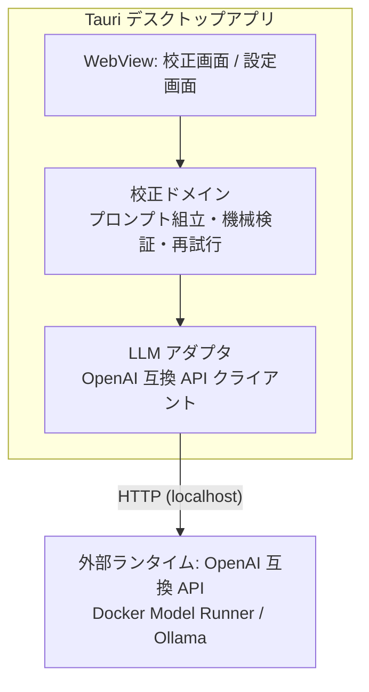
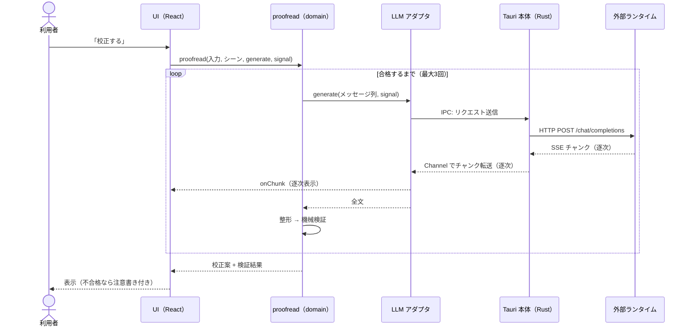

# 設計書 — メッセージ校正デスクトップアプリ

`docs/requirements.md` の要件を実現する設計を定義する。

---

## 1. 全体アーキテクチャ



- シェルは Tauri v2
  - WebView は OS ネイティブのものを使う。macOS では WKWebView[^1]
  - 使える Web 標準機能は Safari 基準で判断する
- LLM への HTTP は `tauri-plugin-http` の `fetch` を使う
  - リクエストが Rust 側から出るため、ランタイム側の CORS 設定が不要になる
  - レスポンスボディは `ReadableStream` として受け取れる（v2.3 以降）
- ロジックはすべてフロントエンド側に置く。Rust は書かない（プラグイン登録のみ）

## 2. 技術スタック

| 領域 | 選定 | 理由 |
|---|---|---|
| シェル | Tauri v2 | 学習対象。軽量で macOS ネイティブ WebView を使う |
| HTTP | tauri-plugin-http | CORS 制約の解消。ストリーミング対応 |
| UI | React | 学習対象 |
| ルーティング | TanStack Router v1 | 学習対象。型安全なルートとローダー |
| ビルド | Vite | Tauri + React の標準構成 |
| 言語 | TypeScript | ドメインロジックの型安全 |
| テスト | Vitest | ドメインロジックの単体テスト |
| パッケージ管理 | pnpm | 学習対象。依存の install スクリプトを既定で実行しない等、サプライチェーン耐性が高い |
| 設定永続化 | localStorage | 設定は数キーのみで Web 標準で足りる |
| CSS | 素の CSS | プリプロセッサ・フレームワークなし。最新の標準機能を使う（§3） |

外部ライブラリは上記のみ。以降の追加は Web 標準 API での代替を検討してからにする[^2]。

## 3. Web 標準 API の採用

機能要件に加え、学習目的で次の標準 API を使う。

- **Streams API** — LLM 応答の逐次処理
  - `res.body → TextDecoderStream → 自作 TransformStream（SSE 分割）→ JSON 解釈`
  - ストリーミング表示は要件ではないが、Streams API の学習として実装する
- **AbortController** — 生成中の中断。校正のやり直しや画面遷移時に使う
- **Clipboard API** — 校正案のコピー
- **Popover API + CSS Anchor Positioning** — コピー成功の通知
  - コピーボタンを `anchor-name` でアンカーにし、`position-anchor` で直上に配置する
  - JavaScript での座標計算をなくす
- **CSS**: Container Queries、ネイティブ Nesting、`:has()`、`@layer`、`light-dark()`、`oklch()`

WKWebView での対応状況は実装時に個別確認する。

## 4. 画面構成とルート

- `__root` — 共通レイアウト。ヘッダーと接続状態表示
  - `/` — 校正画面
  - `/settings` — 設定画面

### 4.1 校正画面 `/`

上から順に次の要素を縦に並べる。

1. シーン切替 — ビジネス / カジュアルのセグメント型トグル
2. 入力エリア — メッセージを貼るテキストエリア
3. 「校正する」ボタン — 生成中は「中断」に変わる
4. 校正案エリア — 逐次表示。機械検証が不合格のときだけ注意書きを添える
5. 「コピー」ボタン — 成功時は Popover で短く通知する

- ボタンは「校正する」と「コピー」の2つのみ
  - 校正し直したいときは「校正する」を再度押す

### 4.2 設定画面 `/settings`

- 接続先: Docker Model Runner / Ollama のプリセットから選択
- モデル: ルートのローダーで `/v1/models` から一覧を取得して選択
- 保存で localStorage へ書き込む

### 4.3 シーン定義

| シーン | 文体 | 想定の送り先 |
|---|---|---|
| ビジネス | 整ったですます調。過剰な敬語にはしない | 社外・目上 |
| カジュアル | くだけたですます調。絵文字や「！」は原文のまま保つ | 社内の同僚 |

どちらのシーンでも読みやすさ・簡潔さを優先する。

## 5. ディレクトリ構成と依存ルール

Feature 型 + ポート＆アダプタで構成する。

```
src/
├─ routes/                ルート定義。features を組み立てて adapter を注入する薄い層
├─ features/              カプセル化。公開は index.ts のみ。feature 同士は参照しない
│  ├─ proofread/
│  │  ├─ components/      コンポーネント単位で .tsx + .css を1組に
│  │  ├─ domain/          純粋ロジック（prompts / validate / proofread）。ポートを定義
│  │  ├─ hooks/           feature 固有 hooks（useProofread: 生成状態・中断の管理）
│  │  └─ index.ts
│  └─ settings/
│     ├─ components/
│     ├─ hooks/
│     └─ index.ts
├─ adapter/               外部世界との接続実装
│  ├─ llm/                OpenAI 互換 API（生成 / モデル一覧）。tauri-plugin-http を使う唯一の場所
│  └─ storage/            設定永続化（localStorage）
├─ domain/                共有ドメイン（接続設定の型・プリセット定義）
├─ components/            アプリ共通 UI。同じく .tsx + .css を1組に
├─ hooks/                 アプリ共通 hooks。必要になるまで作らない
└─ styles/                @layer の順序定義とデザイントークンのみ
src-tauri/                Tauri シェル（規約による固定名）
```

依存はすべて一方向にする。

```
routes → features → domain（共有）・components・hooks
adapter → domain（型のみ）
```

- feature の `domain/` が定義したポート（例: `GenerateFn`）に、routes 層が `adapter/llm` の実装を注入する
  - adapter は features を知らず、features は adapter の実装を知らない
  - ドメインロジックは fetch や Tauri に依存しない純粋 TypeScript になり、モック注入でテストできる
- CSS は各コンポーネントに同名の `.css` を隣接させ、ルートクラス名でスコープする
  - `styles/` には `@layer` の順序（reset → tokens → components）とデザイントークンだけを置く

## 6. 校正ドメインの設計

`features/proofread/domain/` の構成。

| モジュール | 責務 |
|---|---|
| `prompts.ts` | シーン別システムプロンプト・few-shot 例・実行時指示の組立 |
| `validate.ts` | 機械検証。長さ比 / 疑問文の保存 / 新規文字比率（文字単位 LCS） |
| `proofread.ts` | 統合。生成 → 整形 → 検証 → 不合格なら再試行 |

### 6.1 プロンプト設計の原則

事前検証の実測に基づく[^3]。

- システムプロンプトは最小ルールのみ。禁止ルールは書かない
- 入力は固定の依頼文で包み、校正対象のデータであることを形式で示す
- 実行時指示は操作の手順ではなく「出力が満たすべき条件」の形で書く
- few-shot 例の役割はフレームの形と校正の方向性の提示に限る
  - 例は実際のメッセージの分布（複数文・約100文字・質問を含む）に近づける
- シーンはシステムプロンプトと few-shot 例の差し替えで実現する

### 6.2 機械検証と再試行

- 検証項目と初期しきい値は事前検証で較正済みの値を引き継ぐ[^4]
  - 長さ比: 0.4〜1.5 倍
  - 疑問文: 原文にあれば保存、なければ増やさない
  - 新規文字比率: 0.6 以下
- 不合格なら自動で再試行し、上限3回で最後の案を注意書き付きで表示する
- しきい値を変えるときは、正当な校正案と失敗例の両方で判定を確認してから変える

### 6.3 校正のシーケンス



Tauri 側の処理は次のとおり。

- 自作の Rust コードはない。Tauri 側の処理はすべて tauri-plugin-http の中で完結する
- WebView の `fetch` 互換 API は IPC で Rust 側に委譲され、実際の HTTP 通信は Rust の HTTP クライアントが行う
  - WebView から直接通信しないため、CORS 制約を受けない
- レスポンスボディは Tauri の Channel で WebView へ逐次転送され、JS 側では標準の `ReadableStream` として見える
  - 以降の変換（`TextDecoderStream` → SSE 分割）は §3 のとおり WebView 内で行う
- 中断は `AbortSignal` が IPC 経由で Rust 側に伝わり、進行中のリクエストが中止される

| 状況 | 挙動 |
|---|---|
| 接続先に到達できない（校正時） | 校正案エリアに状態と対処方法を表示し、設定画面へ誘導 |
| 接続先に到達できない（設定画面） | ローダーがエラーを返し、ランタイムの起動方法を案内 |
| 生成の中断 | AbortController で中断。エラー扱いにしない |
| 機械検証が上限まで不合格 | 最後の案を注意書き付きで表示し、判断を利用者に委ねる |
| モデル未選択 | 校正ボタンを無効化し、設定画面へ誘導 |

## 8. テスト

- 単体テスト（Vitest）はドメインと adapter の純粋部分が対象
  - `validate.ts`: 合格すべき正当な校正案と、不合格にすべき失敗例の両方を固定ケースで担保
  - SSE 分割の TransformStream: チャンク境界がイベント途中で切れるケースを含めて検証
  - `proofread.ts`: 生成関数をモックし、不合格 → 再試行 → 上限到達の分岐を検証
- 実モデルでの品質確認は手動で行う
  - シーン別プロンプトの調整は、実装フェーズで実測しながら行う

---

[^1]: Tauri は Chromium を同梱せず OS の WebView を使う。macOS は WKWebView（WebKit）、Windows は WebView2（Chromium）、Linux は WebKitGTK。
[^2]: 外部ライブラリは流行り廃りとメンテナンスコストのリスクがあるため、明示的に選定したものだけ使う。Web 標準 API はそのリスクが低い。
[^3]: 検証時の実測で、禁止ルールの追加はその語をかえって誘発して悪化した。操作の手順説明（「そこで文を区切って書き直して」）はベースラインより悪化し、出力条件の記述（「一つの文に『が、』を2つ以上含めない」）だけが有意に改善した。few-shot は語彙を写すが操作は般化しなかった。
[^4]: 新規文字比率のしきい値 0.6 は較正済みの値。0.5 では正当な言い換え（実測 0.52）を誤って弾き、失敗例（メッセージへの返事そのもの）は 0.81 で明確に上に出る。
