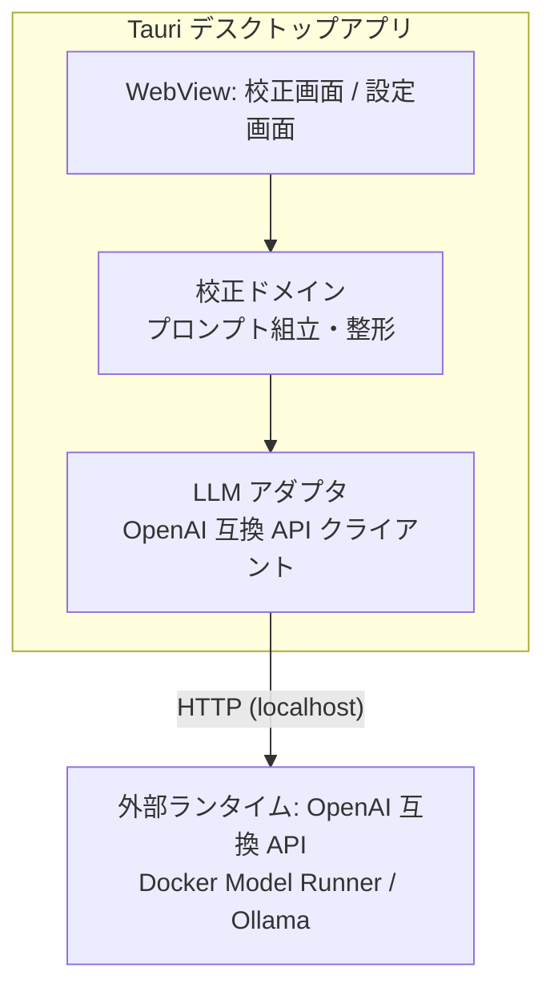
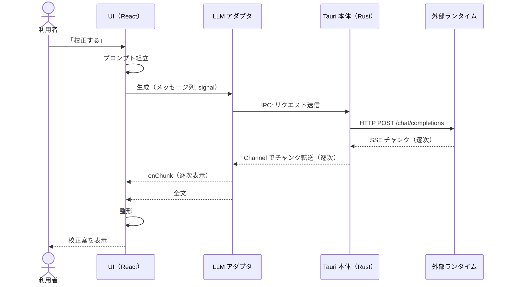

# 設計書 — メッセージ校正デスクトップアプリ

`docs/requirements.md` の要件を実現する設計を定義する。

---

## 1. 全体アーキテクチャ



- シェルは Tauri v2
  - WebView は OS ネイティブのものを使う。macOS では WKWebView[^1]
  - 使える Web 標準機能は Safari 基準で判断する
- LLM への HTTP は `tauri-plugin-http` の `fetch` を使う
  - リクエストが Rust 側から出るため、ランタイム側の CORS 設定が不要になる
  - レスポンスボディは `ReadableStream` として受け取れる（v2.3 以降）
- 外部へ送信できないこと（N1・受け入れの目安5）は、実装ではなく構成で二重に保証する
  - capability の scope で、tauri-plugin-http の許可 URL を `http://localhost` のみに限定する
  - CSP で、WebView 自身の通信先も localhost のみに限定する[^5]
- ロジックはすべてフロントエンド側に置く。Rust は書かない（プラグイン登録のみ）

## 2. 技術スタック

| 領域 | 選定 | 理由 |
|---|---|---|
| シェル | Tauri v2 | 学習対象。軽量で macOS ネイティブ WebView を使う |
| HTTP | tauri-plugin-http | CORS 制約の解消。ストリーミング対応 |
| UI | React | 学習対象 |
| ルーティング | TanStack Router v1 | 学習対象。型安全なルート定義[^9] |
| ビルド | Vite | Tauri + React の標準構成 |
| 言語 | TypeScript | ドメインロジックの型安全 |
| テスト | Vitest | ドメインロジックの単体テスト |
| Lint / Format | oxlint / oxfmt | Vite（Rolldown）と同じ oxc 基盤で揃える。型情報を使った lint には oxlint-tsgolint を併用する[^8] |
| パッケージ管理 | pnpm | 学習対象。依存の install スクリプトを既定で実行しない等、サプライチェーン耐性が高い |
| 設定永続化 | localStorage | 設定は数キーのみで Web 標準で足りる[^6] |
| CSS | 素の CSS | プリプロセッサ・フレームワークなし。最新の標準機能を使う（§3） |

外部ライブラリは上記のみ。以降の追加は Web 標準 API での代替を検討してからにする[^2]。

## 3. Web 標準 API の採用

機能要件に加え、学習目的で次の標準 API を使う。

- **Streams API** — LLM 応答の逐次処理
  - `res.body → TextDecoderStream → 自作 TransformStream（SSE 分割）→ JSON 解釈`
  - ストリーミング表示は学習目的（R6）で採用する
- **AbortController** — 生成中の中断。校正のやり直しや画面遷移時に使う
- **Clipboard API** — 校正案のコピー
- **Popover API + CSS Anchor Positioning** — コピー成功の通知
  - コピーボタンを `anchor-name` でアンカーにし、`position-anchor` で直上に配置する
  - JavaScript での座標計算をなくす
- **CSS**: Container Queries、ネイティブ Nesting、`:has()`、`@layer`、`light-dark()`、`oklch()`

WKWebView での対応状況は実装時に個別確認する。

## 4. 画面構成とルート

- `__root` — 共通レイアウト。ヘッダーと接続状態表示
  - 接続状態は起動時に `/v1/models` への到達可否で判定する
  - 「校正する」の押下時にも再判定し、ランタイムの後起動（N4）からの復帰を反映する
  - `/` — 校正画面
  - `/settings` — 設定画面

接続状態とモデル一覧は同じ通信から分かるため、1つの状態としてルートで持つ。

### 4.1 校正画面 `/`

上から順に次の要素を縦に並べる。

1. シーン切替 — ビジネス / カジュアルのセグメント型トグル
2. 入力エリア — メッセージを貼るテキストエリア
3. 「校正する」ボタン — 生成中は「中断」に変わる
4. 校正案エリア — 校正案を逐次表示する
5. 「コピー」ボタン — 成功時は Popover で短く通知する

- ボタンは「校正する」と「コピー」の2つのみ
  - 校正し直したいときは「校正する」を再度押す

### 4.2 設定画面 `/settings`

- 接続先: Docker Model Runner / Ollama のプリセットから選択
- モデル: `/v1/models` から取得した一覧から選択
  - 接続先を切り替えると取得し直す
- 保存で localStorage へ書き込む

### 4.3 シーン定義

| シーン | 文体 | 想定の送り先 |
|---|---|---|
| ビジネス | 整ったですます調。過剰な敬語にはしない | 社外・目上 |
| カジュアル | くだけたですます調。絵文字や「！」は原文のまま保つ | 社内の同僚 |

どちらのシーンでも読みやすさ・簡潔さを優先する。

## 5. ディレクトリ構成と依存ルール

Feature 型 + ポート＆アダプタで構成する。

```
src/
├─ routes/                ルート定義。features を組み立てて adapter を注入する薄い層
├─ features/              カプセル化。公開は index.ts のみ。feature 同士は参照しない
│  ├─ proofread/
│  │  ├─ components/      コンポーネント単位で .tsx + .css を1組に
│  │  ├─ domain/          純粋ロジック（prompts / cleanGeneratedText）
│  │  ├─ hooks/           画面の状態と操作。ポートを定義
│  │  └─ index.ts
│  └─ settings/
│     ├─ components/
│     ├─ domain/          設定の保管庫のポート
│     ├─ hooks/
│     └─ index.ts
├─ adapter/               外部世界との接続実装
│  ├─ llm/                OpenAI 互換 API（生成 / モデル一覧）。tauri-plugin-http を使う唯一の場所
│  └─ storage/            設定永続化（localStorage）
├─ api/                   LLM API との契約（接続先・メッセージ形式・エラー種別・設定の型）
├─ components/            アプリ共通 UI。同じく .tsx + .css を1組に
├─ hooks/                 アプリ共通 hooks。Context と Provider もここに置く
└─ styles/                @layer の順序定義とデザイントークンのみ
src-tauri/                Tauri シェル（規約による固定名）
```

依存はすべて一方向にする。

```
routes → features → api・components・hooks
adapter → api
```

- `api/` は LLM API との契約を定義するだけで、通信そのものは持たない
  - 契約を使って実際に通信するのが `adapter/llm/`
  - `features/*/domain/` は校正そのもののドメインで、`api/` とは別物
- feature が定義したポート（例: `StreamTextFn`）に、合成の起点が `adapter` の実装を注入する
  - adapter は features を知らず、features は adapter の実装を知らない
  - ドメインロジックは fetch や Tauri に依存しない純粋 TypeScript になり、単体でテストできる
- 合成の起点は `main.tsx` と `routes/`
  - `main.tsx` が Provider を組み立て、アプリ全体で使う adapter を注入する
  - `routes/` は画面ごとの adapter を注入する
- CSS は各コンポーネントに同名の `.css` を隣接させ、ルートクラス名でスコープする
  - `styles/` には `@layer` の順序（reset → tokens → components）とデザイントークンだけを置く

## 6. 校正ドメインの設計

`features/proofread/` の構成。

| モジュール | 責務 |
|---|---|
| `domain/prompts.ts` | シーン別システムプロンプト・few-shot 例・実行時指示の組立 |
| `domain/cleanGeneratedText.ts` | 生成結果の整形。思考タグ・区切り線・引用符の除去 |
| `hooks/useProofreadPage.ts` | 統合。プロンプト組立 → 生成 → 整形と、画面の状態・中断 |

### 6.1 プロンプト設計の原則

事前検証の実測に基づく[^3]。

- システムプロンプトは最小ルールのみ。禁止ルールは書かない
- 入力は固定の依頼文で包み、校正対象のデータであることを形式で示す
- 実行時指示は操作の手順ではなく「出力が満たすべき条件」の形で書く
- few-shot 例の役割はフレームの形と校正の方向性の提示に限る
  - 例は実際のメッセージの分布（複数文・約100文字・質問を含む）に近づける
- シーンはシステムプロンプトと few-shot 例の差し替えで実現する

### 6.2 生成パラメータと出力の扱い

- temperature は 0.7 とする
  - 事前検証で較正した値で、案の多様性（F3）を担保する[^4]
  - 既定モデル（Gemma 4 E4B）での較正値なので、モデルを変えたら再較正の対象になる
- 出力の妥当性はアプリが機械的に判定しない
  - 校正案が原文の意味を保っているかの確認は利用者が行う

### 6.3 校正のシーケンス



Tauri 側の処理は次のとおり。

- 自作の Rust コードはない。Tauri 側の処理はすべて tauri-plugin-http の中で完結する
- WebView の `fetch` 互換 API は IPC で Rust 側に委譲され、実際の HTTP 通信は Rust の HTTP クライアントが行う
  - WebView から直接通信しないため、CORS 制約を受けない
- レスポンスボディは Tauri の Channel で WebView へ逐次転送され、JS 側では標準の `ReadableStream` として見える
  - 以降の変換（`TextDecoderStream` → SSE 分割）は §3 のとおり WebView 内で行う
- 中断は `AbortSignal` が IPC 経由で Rust 側に伝わり、進行中のリクエストが中止される

## 7. エラー処理

| 状況 | 挙動 |
|---|---|
| 接続先に到達できない（校正時） | 校正案エリアに状態と対処方法を表示し、設定画面へ誘導 |
| 接続先に到達できない（設定画面） | モデル欄にランタイムの起動方法を案内 |
| 生成の中断 | AbortController で中断。エラー扱いにせず、接続状態も変えない[^10] |
| モデル未選択 | 校正ボタンを無効化し、設定画面へ誘導 |

## 8. テスト

- 実装の最初に、使い捨ての最小実装（スパイク）で通信経路を検証し、SSE の逐次受信と `AbortSignal` での中断を確認する[^7]
- 単体テスト（Vitest）はドメインと adapter の純粋部分が対象
  - `prompts.ts`: system + few-shot 対 + 実入力の並びと、フレームの形を検証
  - `cleanGeneratedText.ts`: 思考タグ・区切り線・引用符の除去を検証
  - SSE 分割の TransformStream: チャンク境界がイベント途中で切れるケースを含めて検証
  - `client.ts`: 送信内容・エラー種別・リダイレクト禁止を、fetch をモックして検証
  - 接続状態の判定: 到達できたうえでの失敗を接続できている証拠として扱うことを検証
- 実モデルでの品質確認は手動で行う
  - シーン別プロンプトの調整は、実装フェーズで実測しながら行う

---

[^1]: Tauri は Chromium を同梱せず OS の WebView を使う。macOS は WKWebView（WebKit）、Windows は WebView2（Chromium）、Linux は WebKitGTK。
[^2]: 外部ライブラリは流行り廃りとメンテナンスコストのリスクがあるため、明示的に選定したものだけ使う。Web 標準 API はそのリスクが低い。
[^3]: 検証時の実測で、禁止ルールの追加はその語をかえって誘発して悪化した。操作の手順説明（「そこで文を区切って書き直して」）はベースラインより悪化し、出力条件の記述（「一つの文に『が、』を2つ以上含めない」）だけが有意に改善した。few-shot は語彙を写すが操作は般化しなかった。
[^4]: 事前検証で temperature を 0.4 まで下げたところ、再校正しても同じ案に収束する事象が出た（案が完全一致）。低温度は F3 と両立しない。

[^5]: capability の scope が制限するのは tauri-plugin-http 経由の通信のみで、WebView 標準の `fetch` や画像読み込みは対象外。これらは `tauri.conf.json` の `app.security.csp`（`connect-src` など）で制限し、依存パッケージに紛れたコードからの外部送信も防ぐ。

[^6]: WKWebView のウェブサイトデータは OS の管理で削除され得るため、Tauri アプリとしての永続化先と保持のされ方は実装時に確認する。

[^7]: 事前検証はブラウザの `fetch` でランタイムに直結しており、tauri-plugin-http 経由（IPC → Rust → Channel）の逐次受信と中断は未実測。成り立たない場合はストリーミング表示と中断の設計を見直すため、作り込みの前に確かめる。

[^8]: oxfmt は beta（pre-1.0）だが、Prettier の JS/TS 準拠テストに 100% 合格しており、大規模 OSS での採用実績もある。安定版が出たら追従する。

[^9]: ローダーは使わない。ローダーは React の外で走るため、Context に置いた設定を読めない。設定を読めるようにするには localStorage を直接読むことになり、設定の持ち主が state とストレージの2系統に割れる。

[^10]: 中断された通信を「接続できない」と扱わないよう、adapter は中断時の例外に種別を付けずそのまま伝える。
